# ICMP重定向实验

## 任务1：实施ICMP重定向攻击

docker 格局：
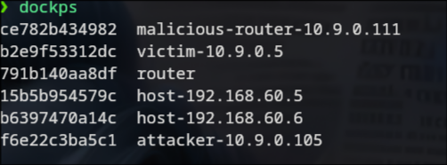

初始时的victim机器路由表如图：

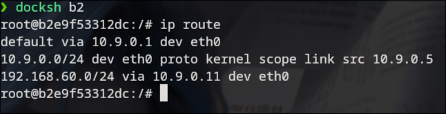

然后victim机器运行命令：

```
mtr -n 192.168.60.5
```

此时结果如图：
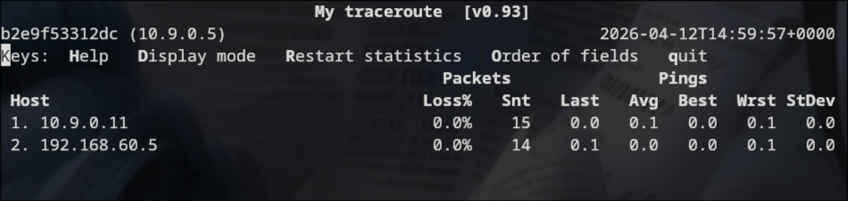

attacker机器运行命令：

```
python3 volume/ICMP_Redirect.py
```

则受害者的mtr结果变为：
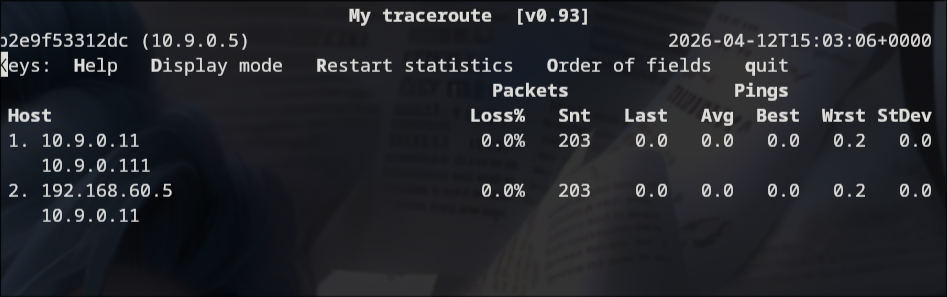

查看此时受害者的路由缓存：
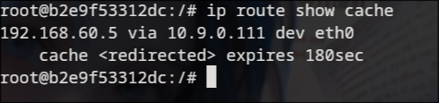

## 任务2：实施MITM攻击

docker格局：

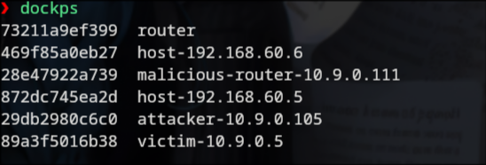

首先，将malicious-router设置为不转发。

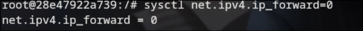

然后启动malicious-router的mitm程序

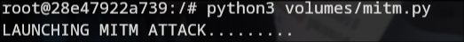

先在victim-host上启动icmp:

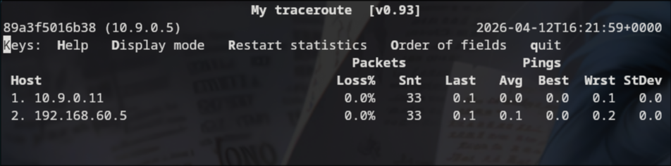

在attacker上发起icmp重定向攻击

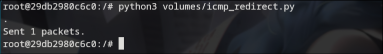

此时， vittim-host上的路由变为：

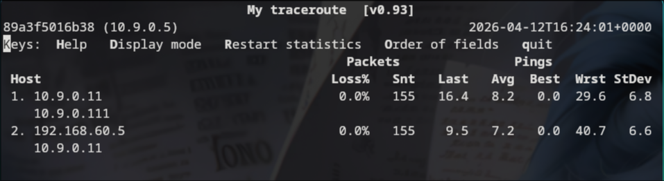

可以看到，路由缓存

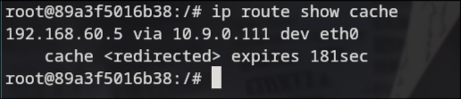

启动host-192.168.60.5上的nc程序

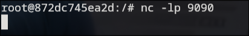

启动victim-host的nc程序

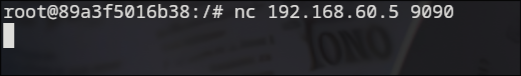

开始通信，查看效果
victim-host:

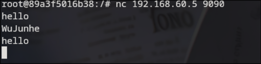

host-192.168.60.5:

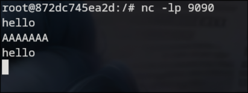

可以看到，这里我们成功把tcp报文改变了。把我的名字（WuJunhe）修改为了7个大写的A。
此时malicious-router日志：

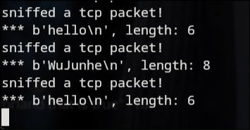

## 问题回答

## 经验教训

主要是任务2：

1. 一开始mitm程序仿照教程，只处理了tcp,没有处理icmp.导致路由总是迅速恢复成正确路由。同时，我并不知道sysctl net.ipv4.ip_forward=0可以直接执行，每次都是修改docker-compose-yml,重新dcup。结果就是，forward=1的时候，我修改好了路由。然后我就重启了，导致修改好的路由丢失，配置成forward=0时又没有处理icmp,结果一致连不上。
2. 大量重启，mac地址总在变化。于是使用arp协议直接查找victim-host的mac地址。

